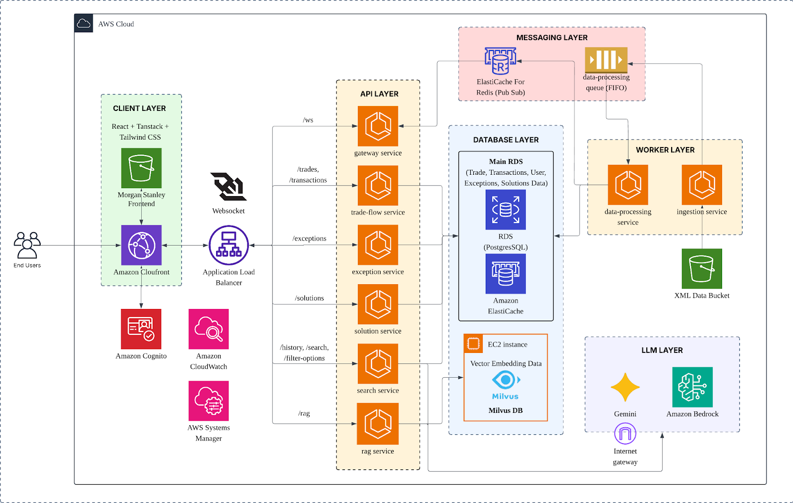

# SMUMS - AI-Driven Modern OTC Derivatives Clearing Application
## SMU-X CS480 Project Experience

SMUMS is a collaborative capstone project by **SMU x Morgan Stanley** focused on modernizing OTC derivatives clearing workflows with an AI-powered web platform.

The platform improves trade monitoring, exception handling, and investigation workflows through natural language search, graph-powered context, and guided resolution playbooks.

## Product Demo

[](https://www.youtube.com/watch?v=dKCmoeBax7A)

- Product Video: https://youtu.be/dKCmoeBax7A

## Architecture Diagram



## Problem Statement

Legacy list-based interfaces create inefficiencies in:

- Monitoring trade status end-to-end
- Managing counterparty and transaction risk
- Triaging and resolving exceptions quickly

## Solution Summary

The solution is an AI-augmented clearing platform with three core modules:

- **AI-driven Search**: Natural language search over trades, transactions, and exceptions
- **Exception Management**: RAG-assisted workflows with AI-generated resolution steps
- **Flow Data Visualization**: Real-time, node-based flow views with exception highlighting

## Key Capabilities

- Knowledge graph-backed relationship and root-cause exploration
- Narrative-based embeddings for richer contextual retrieval
- Guided playbook execution for operators and analysts
- Multi-factor ranking for urgent and high-risk exceptions

## High-Level Architecture

The project is organized as a microservices-based platform with:

- Frontend web application
- API gateway and domain services
- Messaging and background worker services
- Data layer (relational and vector/graph stores)
- Cloud infrastructure managed via Terraform

## Tech Stack

- Frontend: React, TypeScript, Vite, Tailwind
- Backend: Node.js and Python microservices
- Data/Storage: PostgreSQL, Neo4j, Milvus, Redis, S3
- Infrastructure: Docker, Docker Compose, Terraform, AWS
- Testing: Vitest, Playwright, Jest, Pytest

## Repository Structure

```text
.
├── infrastructure/            # Terraform definitions and modules
├── morgan-stanley-frontend/   # Frontend application
└── services/                  # Backend and supporting services
```

## Quick Start

### Prerequisites

- Node.js (LTS)
- Python 3.10+
- Docker and Docker Compose
- Terraform (for infrastructure provisioning)

### Run Locally (Service Layer)

From the repository root:

```bash
cd services
docker compose up --build
```

### Run Frontend

```bash
cd morgan-stanley-frontend
npm install
npm run dev
```

## Deployment

- AWS Deployment: https://d10aqqi0011qw9.cloudfront.net

## Team

**Team:** SMU x Morgan Stanley (SMUMS)

- Xie Wenkai
- Koh Sheng Wei
- Tan He Qiang
- Chua Wei Qi
- Lee Min
- Chen Hua-En

**Faculty Supervisor:** Professor Vincent Oh Yan Ming

**Industry Sponsors:** Morgan Stanley OTC Derivatives Clearing Team

## License

Copyright (c) 2026 SMUMS Team. All rights reserved.

This repository is part of SMU-X CS480 Project Experience and is not licensed for public reuse, distribution, or commercial use without explicit permission.
